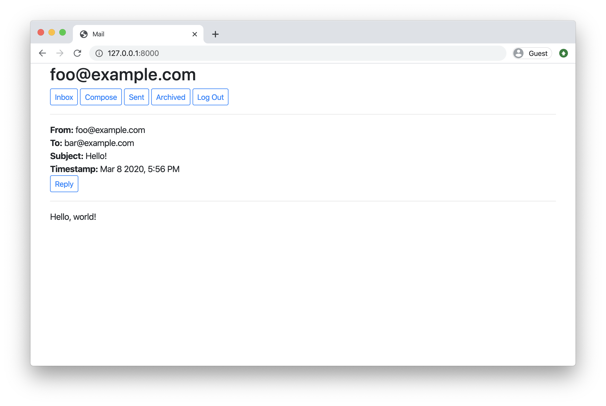
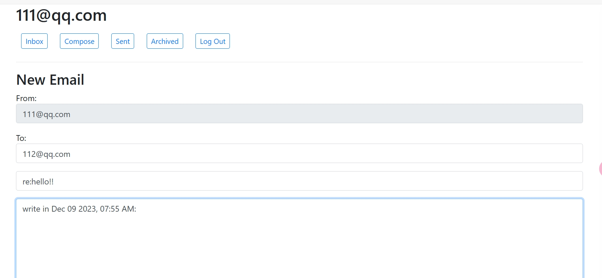

## 项目描述

实现一个单页的电子邮件客户端，代码框架已经提供，仅仅需要javascript 完成接受邮件，发送邮件的功能。项目地址:[cs50-mail](https://cs50.harvard.edu/web/2020/projects/3/mail/)




## 项目要求

翻译官网要求后，技术要点如下:

1. **发送邮件:**
   
   - 在提交电子邮件组成表单时，使用JavaScript发送电子邮件。
   - 使用JavaScript向`/emails`发起POST请求，包含收件人、主题和正文的数值。
   - 发送电子邮件后，加载用户的已发送邮箱。

2. **邮箱:**
   
   - 当用户导航到收件箱、已发送或存档时，加载相应的邮箱。
   - 使用GET请求向`/emails/<mailbox>`检索该邮箱的电子邮件。
   - 在页面顶部显示邮箱的名称。
   - 在独立的框（<div>）中呈现每封电子邮件，显示发件人、主题和时间戳。
   - 未读电子邮件具有白色背景；已读电子邮件具有灰色背景。

3. **查看邮件:**
   
   - 单击电子邮件应显示其内容。
   - 使用GET请求向`/emails/<email_id>`检索电子邮件。
   - 显示发件人、收件人、主题、时间戳和正文。
   - 在`inbox.html`中添加一个新的div用于显示电子邮件。
   - 更新代码以在导航时隐藏/显示正确的视图。

4. **标记为已读:**
   
   - 单击电子邮件时将其标记为已读。
   - 使用PUT请求向`/emails/<email_id>`发送更新已读状态的请求。

5. **存档和取消存档:**
   
   - 允许用户存档和取消存档电子邮件。
   - 对于收件箱电子邮件，显示一个“存档”按钮；对于已存档电子邮件，显示一个“取消存档”按钮。
   - 使用PUT请求向`/emails/<email_id>`发送标记电子邮件为已存档或取消存档的请求。
   - 存档或取消存档后，加载用户的收件箱。

6. **回复:**
   
   - 允许用户回复电子邮件。
   - 在查看电子邮件时显示一个“回复”按钮。
   - 单击“回复”按钮应导航到电子邮件组成表单。
   - 在原始发件人字段中预填写原始发件人。
   - 如果主题行尚未以“Re:”开头，则预填写主题行为“Re: 原始主题”。
   - 在正文中预填写“在原始时间戳原始发件人写道:”后跟原始文本。

## 核心技术要点

### 调用api

使用js中的`fetch` api来获取邮件,以及更新邮件的信息，创造邮件。示例代码如下：
**获取inbox的邮件**

```javascript
fetch('/emails/inbox')
.then(response => response.json())
.then(emails => {
    // Print emails
    console.log(emails);

    // ... do something else with emails ...
});
```

**获取单个邮件**

```javascript
fetch('/emails/100')
.then(response => response.json())
.then(email => {
    // Print email
    console.log(email);

    // ... do something else with email ...
});
```

**创造邮件**

```javascript
fetch('/emails', {
  method: 'POST',
  body: JSON.stringify({
      recipients: 'baz@example.com',
      subject: 'Meeting time',
      body: 'How about we meet tomorrow at 3pm?'
  })
})
.then(response => response.json())
.then(result => {
    // Print result
    console.log(result);
});
```

**更新邮件**

```javascript
fetch('/emails/100', {
  method: 'PUT',
  body: JSON.stringify({
      archived: true
  })
})
```

### 创造HTML元素，为元素添加类

由于页面全部由js实现，所以我们需要用js来创造HTML元素，为了实现更加美观的元素布局，我们还需要为元素添加类名，便于为元素添加css，除此之外，还需要为元素块设置监听，来更好的实现邮件客户端的功能。

**创造元素，监听元素**

```javascript
const element = document.createElement('div');
element.innerHTML = 'This is the content of the div.';
element.addEventListener('click', function() {
    console.log('This element has been clicked!')
});
```

**为元素添加类**

```javascript
// 创建一个 div 元素
const element = document.createElement('div');
// 设置 div 元素的内容
element.innerHTML = 'This is the content of the div.';
// 添加一个类到 div 元素
element.classList.add('my-custom-class');
// 添加点击事件监听器
element.addEventListener('click', function() {
    // 在控制台中输出消息
    console.log('This element has been clicked!');
});
// 将元素添加到文档的 body 中
document.body.appendChild(element);
```

`classList.add`中可以添加多个类名参数,`appendchild`函数用于将创造好的HTML元素加入到文档中。

## 个人的代码实现

### 效果展示

               
                               **inbox页面 已读使用灰色背景色来标注未读邮件**


                                                    **邮件的详情页面**




                                     **点击reply后，进入compose页面并且预填写信息**


代码`inbox.js`，技术细节我会在下一篇博客探讨。

```javascript
  document.addEventListener('DOMContentLoaded', function() {

  // Use buttons to toggle between views
  document.querySelector('#inbox').addEventListener('click', () => load_mailbox('inbox'));
  document.querySelector('#sent').addEventListener('click', () => load_mailbox('sent'));
  document.querySelector('#archived').addEventListener('click', () => load_mailbox('archive'));
  document.querySelector('#compose').addEventListener('click', compose_email);
  document.querySelector('input[type="submit"]').addEventListener('click',send_email)
  // By default, load the inbox
  load_mailbox('inbox');
});

function compose_email() {

  // Show compose view and hide other views
  document.querySelector('#emails-view').style.display = 'none';
  document.querySelector('#compose-view').style.display = 'block';

  // Clear out composition fields
  document.querySelector('#compose-recipients').value = '';
  document.querySelector('#compose-subject').value = '';
  document.querySelector('#compose-body').value = '';

}

function load_mailbox(mailbox) {
  
  // Show the mailbox and hide other views
  document.querySelector('#emails-view').style.display = 'block';
  document.querySelector('#compose-view').style.display = 'none';
  // Show the mailbox name
  document.querySelector('#emails-view').innerHTML = `<h3>${mailbox.charAt(0).toUpperCase() + mailbox.slice(1)}</h3>`;

  fetch('/emails/'+mailbox)
  .then(response => response.json())
  .then(emails => {
      // create the html email to display each email
      displayEmails(emails);
  });


}

function displayEmails(emails) {
  const emailsContainer = document.querySelector('#emails-view');

  // Clear previous content
  emailsContainer.innerHTML = '';

  // Iterate through each email and create HTML for display
  emails.forEach(email => {
    const emailDiv = document.createElement('div');
    emailDiv.className='email'

    const senderDiv = document.createElement('div');
    senderDiv.innerHTML = `<strong>From:</strong> ${email.sender}`;
    emailDiv.appendChild(senderDiv);

    const subjectDiv = document.createElement('div');
    subjectDiv.innerHTML = `<strong>Subject:</strong> ${email.subject}`;

    emailDiv.appendChild(subjectDiv);

    const timestampDiv = document.createElement('div');
    timestampDiv.innerHTML = `<strong>Timestamp:</strong> ${email.timestamp}`;
    emailDiv.appendChild(timestampDiv);

    // Add click event to view email details
    emailDiv.addEventListener('click', () => loadEmailsDetails(email.id));
    if (email.read){
        emailDiv.classList.add('read')
    }
    else {
        emailDiv.classList.add('unread')
    }

    // Append the email HTML to the container
    emailsContainer.appendChild(emailDiv);
    emailsContainer.appendChild(document.createElement('hr'))
  });
}

function loadEmailsDetails(email_id)
{
    // load single email and have detailed information
    const emailsContainer = document.querySelector('#emails-view');
    emailsContainer.innerHTML = '';

    // mark the email is readable
    fetch('emails/'+email_id,{
        method:'put',
        body:JSON.stringify({
            read:true
        })
    });


    // add email more style
    fetch('emails/' + email_id)
      .then(response => response.json())
      .then(email => {
        // create the email block
        const preBlock = document.createElement('div');
        preBlock.classList.add('email-block','border','border-primary','border-sm','rounded'); // 添加自定义类和Bootstrap类
        emailsContainer.appendChild(preBlock);


        // Sender
        const sender = document.createElement('div');
        sender.innerHTML = '<strong>sender: </strong>'+email.sender;
        preBlock.appendChild(sender);

        // Subject
        const subject = document.createElement('div');
        subject.innerHTML ='<strong>subject: </strong>'+ email.subject;
        preBlock.appendChild(subject);

        // Divider
        const divider = document.createElement('hr');
        emailsContainer.appendChild(divider);

        // Body
        const body = document.createElement('div');
        body.classList.add('email-body','border','border-primary','border-sm','rounded','rounded-md')
        body.innerHTML = email.body;

        emailsContainer.appendChild(body)


        // Buttons Container
        const buttonsContainer = document.createElement('div');
        buttonsContainer.classList.add('buttons-container', 'bg-light'); // 添加自定义类和Bootstrap类

        // Archive Button
        const buttonArchive = document.createElement('button');
        buttonArchive.type = 'button';
        buttonArchive.textContent = 'Archive';
        buttonArchive.classList.add('btn', 'btn-primary'); // 添加Bootstrap按钮类
        buttonArchive.addEventListener('click', () => archive_email(email_id));
        buttonsContainer.appendChild(buttonArchive);

        // Reply Button
        const buttonReply = document.createElement('button');
        buttonReply.type = 'button';
        buttonReply.textContent = 'Reply';
        buttonReply.classList.add('btn', 'btn-secondary'); // 添加Bootstrap按钮类
        buttonReply.addEventListener('click', () => reply_email(email_id));
        buttonsContainer.appendChild(buttonReply);

        emailsContainer.appendChild(buttonsContainer);
      });


}

function archive_email(eid){
    // send put request and redirect to inbox page
    fetch('/emails/'+ eid, {
        method: 'PUT',
        body: JSON.stringify(
            {archived: true})
    });
    load_mailbox('inbox');


}

function reply_email(eid) {
    console.log(eid);
    // load compose view
    compose_email();
    fetch('/emails/' + eid)
        .then(response => response.json())
        .then(email => {
            // load
            document.querySelector('#compose-recipients').value = email.sender;
            document.querySelector('#compose-subject').value = 're:' + email.subject;
            document.querySelector('#compose-body').value = 'write in ' + email.timestamp + ': ';
        });
}


function send_email(){

  // get the content
  let recipients = document.querySelector('#compose-recipients').value;
  let subject = document.querySelector('#compose-subject').value;
  let body = document.querySelector('#compose-body').value;

  // send the post requests
  fetch('/emails', {
    method: 'POST',
    body: JSON.stringify({
        recipients: recipients,
        subject: subject,
        body: body
    })
  })
  // return message
  .then(response => response.json())
  .then(result => {
      console.log(result);
  });
  // redirect to send box
  load_mailbox('sent');
}

```
